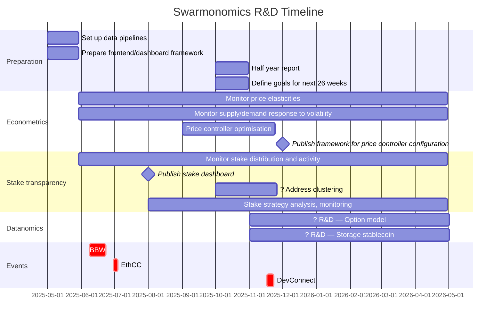

# Research programme: Swarmonomics

*Shtuka Research	2025-04-04*

## Context

Swarm is entering a new phase of its existence, with a renewed focus on UX, network enhancement, and economic model strengthening. As genuine economic activity ramps up on the Swarm Network, the Swarm Protocol maintainers can expect heightened competition and strategic activity among node operators and greater demand for transparency from users and suppliers alike. The need for greater introspection, analysis, and principled policy on the Swarm economy has grown accordingly.

Shtuka Research will aid this transition by developing a principled, objectives-based approach to protocol and parameter upgrades, improving transparency by gathering and publishing econometric data, and investigating the construction of novel financial primitives based on the Swarm Network economy.

## Work programme

Shtuka Research will undertake econometric, mechanism design, and financial studies on the Swarm Protocol and Swarm Network. The programme length is 1 year.

Topics will be drawn from among the following:

* *Stake transparency.* Econometrics: Publish a staking dashboard monitoring stake APY, stake distribution, and strategic activity. Cluster node operator addresses and measure distribution of node count and stake control by entity. 
  **Impact.** Improves transparency and hence lowers barriers to entry for prospective NOs. *Priority: high*
* *Supply elasticity studies.* Econometrics. Monitor price elasticity of supply. Set up data pipelines, carry out statistical analysis, and publish dashboards.
  **Impact.** This elasticity tell us how effective the price oracle is at controlling replication rate, and hence gives insights into how to configure it (minimum price, target, etc.). *Priority: very high/triage*
* *Volatility studies.* Econometrics: Monitor response of supply and demand to volatility. Set up data pipelines, carry out statistical analysis, and publish dashboards.
  **Impact.** Understanding the effect of price volatility will help us understand which features might be throttling risk averse supply/demand and triage which areas to investigate further. If demand responds negatively to BZZ/USD volatility, we might wish to investigate stablecoin payments; if supply or demand responds negatively to price oracle volatility, we may wish to prioritise stability of the price oracle. *Priority: very high/triage*.
* *Price controller.* Control theory: study performance (transient response, stability) of price oracle controller. Develop principled approach to choosing learning rate and consider introducing additional terms (e.g. I term).
  **Impact.** A principled approach to configuration of the price oracle will allow the Swarm maintainers to choose parameters with confidence and reassure users and investors that the system will continue to hit its targets. *Priority: high*
* *Supply elasticity incentivisation.* Mechanism design: Investigate methods to stimulate increased elasticity of supply.
  **Impact.** An elastic supply side means a scalable Swarm Network that can respond to the increased demand pressure we expect over the next year. *Priority: mid/high*
* *Node strategies.* Mechanism design: study aggressive node operator strategies with RL optimisation and simulation. Investigate "ghettoisation" strategy. Devise and deploy methods for detecting strategic behaviour.
  **Impact.** Revealing the strategic and competitive landscape improves transparency for NOs, hence lowering the barrier to entry to a currently opaque market, and reveals potential issues to the Swarm Protocol maintainers before they happen. *Priority: high*
* *Combined pricing of bandwidth and storage resources.* Datanomics/DeFi: develop option model of cost tradeoff between at-rest storage and bandwidth.
  **Impact.** A well-founded financial model would help us understand operator costs and pricing of storage contracts; if the model becomes widely known, it could lower barriers to entry for NOs and facilitate a more efficient storage market. *Priority: mid*.
* *Storage stablecoin.* Datanomics/DeFi: Investigate the construction of a "storage stablecoin" via pooling of transferable storage quotas or synthetic methods.
  **Impact.** A storage stablecoin would unlock elastic, easily scalable cloud storage on a decentralised backbone. While potentially very high impact in the long run, it might be some time before this line of work results in a concrete implementation. *Priority: mid/high*.

## Project management

### Timeline

Project began 1st May.

### Milestones

* Month 3. Publish staking dashboard, displaying stake distribution and stake update activity per neighbourhood, staking APY. Later, we will seek to add address labels (for displaying NO market share per entity) and identify strategic behaviour.
* Month 7. Publish principled framework for price controller configuration as SWIP. Establish priorities based on econometric observations.
* Further milestones to be agreed at a review phase around month 6.
